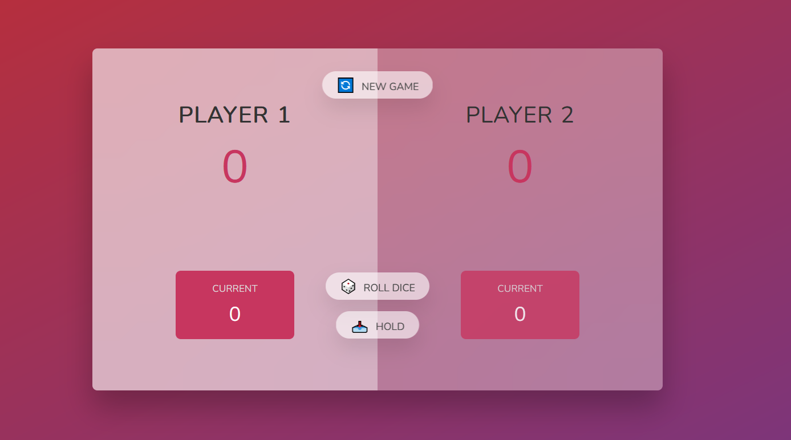
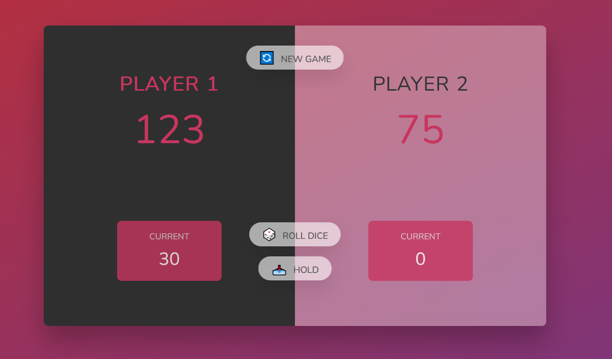

# [Pig Game](https://patriciazan.github.io/PigGame-JS-Course/)
**ENG**

This is the second project made during the course ['The Complete JavaScript Course 2024: From Zero to Expert!']((https://www.udemy.com/course/the-complete-javascript-course/)) on Udemy.

 In this project a die game was created, this game plays with 2 players. Each player can row a dice as many times before a 1 dice is rolled, if so the player loses the previous dices and the turn goes to the other player, if not the player con chose to hold the current sum of dices to the score.
 The main objective is to reach the 100 sum before the other player does.

**PT-BR**

Esse é o segundo projeto realizado no curso ['The Complete JavaScript Course 2024: From Zero to Expert!']((https://www.udemy.com/course/the-complete-javascript-course/)) pela Udemy.

 Nesse projeto um jogo do dado foi criado, jogado entre 2 players. Cada jogador pode 'lançar' um dado quantas vezes desejar até que um dado de valor 1 seja sorteado, caso isso ocorra o jogador perde a soma dos dados anteriores e a vez passa para o outro jogador, caso isso não ocorra o jogador da vez pode escolher em manter o valor total dos dados e adicionar a seu score.
 O objetivo principal é que o score atinja 100 antes de seu oponente.

 The starting state of the game(O estado inicial do jogo)
 
 The  final/winning state of the game(O estado final/vitorioso da partida)
 